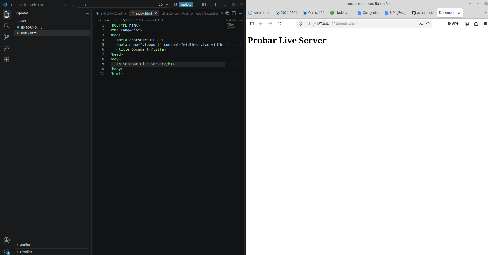

## 1. Sistema Operativo
**Sistema Operativo:** Linux

## 2. Herramientas Instaladas y Versiones
**Node.js:** v24.21.0
**npm:** 11.19.0
**Git:** 2.43.0
**Visual Studio Code:** 1.137.0

## 3. Extensiones Instaladas en VS Code
**Live Server:** `ritwickdey.LiveServer` - Servidor local con regarga automática.
**Prettier - Code formatter:** `esbenp.prettier-vscode` - Formateador automático de código.
**ESLint:** `dbaeumer.vscode-eslint` - Detección de errores y malas prácticas.
**Angular Languaje Service:** `Angular.ng-template` - Autocompletado y errores en plantillas Angular.
**Error Lens** `usernamehw.errorlens` - Muestra los errores en la propia línea.
**Git Graph** `usernamehw.errorlens` - Historial de Git en forma de gráfico
**Spanish Language Pack** `MS-CEINTL.vscode-language-pack-es` - Interfaz de VS Code en español

## 4. Comprobación del Entorno
Creé una página básica de HTML y añadí un h1 que al guardar, automáticamente se actualiza la página cuando la abres con Live Server.

## 5. Problemas Encontrados y Soluciones
**Problema:** Al ejecutar el comando 'node' en mi consola CMD para comprobar la versión, me daba error porque no lo tenía instalado.

**Solución:** Busqué en la guía y lo instalé de 0.