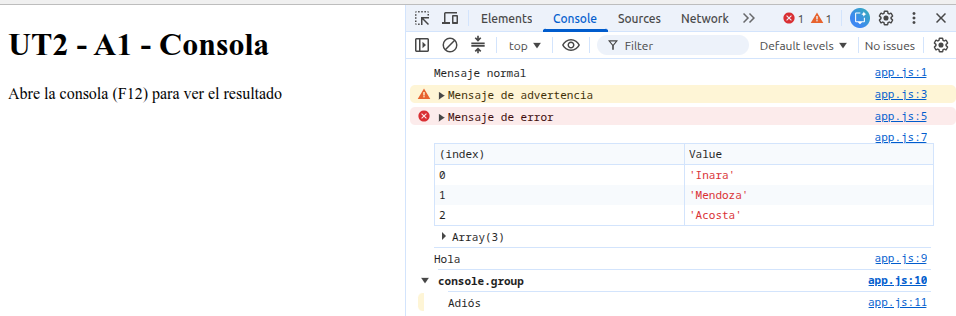
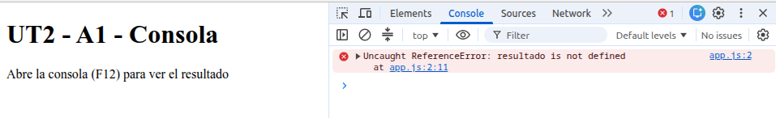

# La consola es tu terminal

## 2. Así se ve en Live Server y en la consola

## 3. Diferencias y añadir error de alert
La única diferencia que hay es visual, pero ambos ejecutan bien los console empleados
Al añadir alert('Hola'); y ejectuarlo en Node aparece un error porque la función de alert no está definida en node.js 

## 4. Añadir use strict
Si solo ponemos resultado = 42, no da error porque crea una variable global y cuando ponemos el 'use strict' da error porque la variable resultado no está declarada
